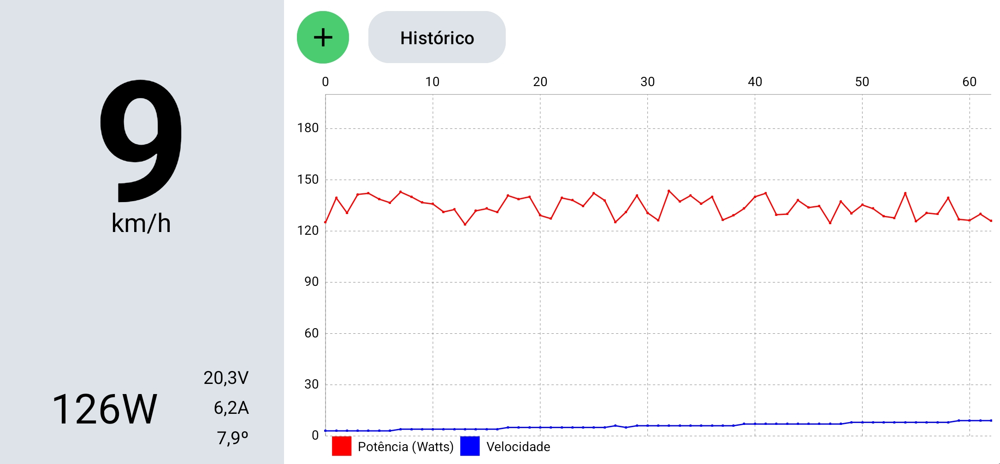
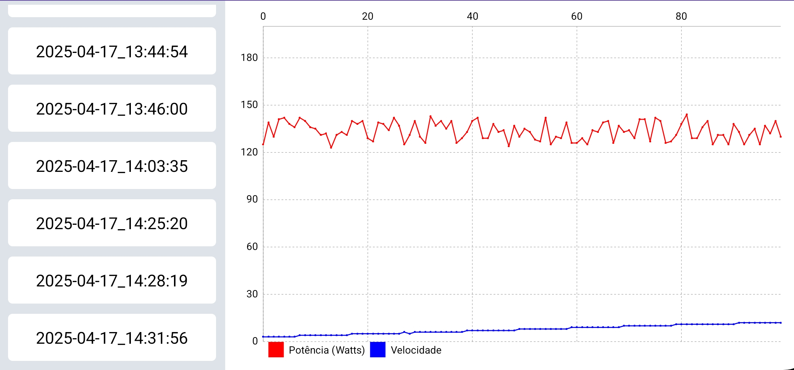

# Painel do carro elétrico

O carro elétrico é um projeto da UPM que conta com alunos de diversos cursos da escola de Engenharia. Consiste na fabricação de um carro que permita alcançar a eficiência energética, utilizando-se de técnicas e conhecimentos das áreas da mecânica, elétrica, eletrônica, programação, entre outras. O objetivo é a participação na [Shell Eco-marathon](https://www.shellecomarathon.com/), que é um programa acadêmico global focado em eficiência energética e uma das principais competições de estudantes de engenharia do mundo. 

Além da estrutura mecânica e elétrica, o carro usa sensores que permitem o monitoramento do consumo de corrente e tensão, temperatura e velocidade do carro. Estes dados são disponibilizados em um painel; uma aplicação desenvolvida para um smartphone que é fixado no volante do carro para que o piloto possa acompanhar o desempenho do veículo de acordo com suas ações. 

Este repositório guarda o projeto do painel do carro utilizado pela UPM na competição.  

## Estrutura do repositório 

O projeto do painel é composto por duas partes: 

* Código para o microcontrolador Arduino Uno, código em C++ usando a Arduino IDE para desenvolvimento. Este se encontra no diretório arduino;  
* Código da aplicação móvel para dispositivos Android, nas linguagens Java/Kotlin, utilizando o software Android Studio. Este se encontra no diretório painel.

Arquivos adicionais usados para testes podem ser encontrados no diretório referencias. 

Toda comunicação entre o Arduino e a aplicação é feita via cabo USB, em protocolo serial UART (Universal Asynchronous Receiver-Transmitter). Os dados dos sensores após tratamento são empacotados em uma string em formato JSON, e enviadas para aplicação que recebe esta string e mostra os valores.
